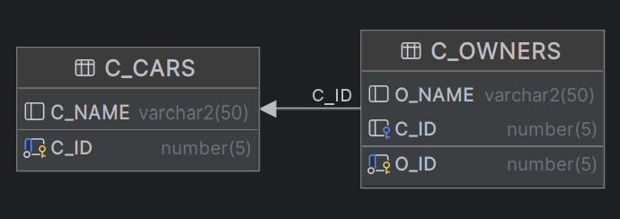

[↑ Back](./README.md)

# `B101` - Joining tables / The Cars Schema

## Schema diagram



## Creating the schema

1. Drop the tables if they exist.

   ```sql
   DROP TABLE c_owners PURGE;
   DROP TABLE c_cars PURGE;
   ```

1. Create the `c_cars` table.

   ```sql
   CREATE TABLE c_cars (
      c_id NUMBER(5),
      c_name VARCHAR2(50),
      CONSTRAINT cars_pk PRIMARY KEY(c_id)
   );
   ```

1. Create the `c_owners` table.

   ```sql
   CREATE TABLE c_owners(
      o_id NUMBER(5),
      o_name VARCHAR2(50),
      c_id NUMBER(5),
      CONSTRAINT owners_pk PRIMARY KEY (o_id),
      CONSTRAINT owners_fk FOREIGN KEY (c_id) REFERENCES c_cars(c_id)
   );
   ```

1. Insert two cars.

   ```sql
   INSERT INTO c_cars (c_id, c_name) VALUES (1, 'Car without owner');
   INSERT INTO c_cars (c_id, c_name) VALUES (2, 'Car with owner');
   ```

1. Insert two owners.

   ```sql
   INSERT INTO c_owners (o_id, o_name, c_id) VALUES (1, 'Owner without car', null);
   INSERT INTO c_owners (o_id, o_name, c_id) VALUES (2, 'Owner with car', 2);
   ```

1. Save the changes.

   ```sql
   COMMIT;
   ```

## Checking `JOIN` types

### `(INNER) JOIN`

#### Syntax

```sql
SELECT *
FROM c_cars
    INNER JOIN c_owners ON c_cars.c_id = c_owners.c_id;
```

```sql
SELECT *
FROM c_cars
    JOIN c_owners ON c_cars.c_id = c_owners.c_id;
```

#### Output

| C\_ID | C\_NAME        | O\_ID | O\_NAME        | C\_ID |
| :---- | :------------- | :---- | :------------- | :---- |
| 2     | Car with owner | 2     | Owner with car | 2     |


### `LEFT (OUTER) JOIN`

#### Syntax

```sql
SELECT *
FROM c_cars
    LEFT OUTER JOIN c_owners ON c_cars.c_id = c_owners.c_id;
```

```sql
SELECT *
FROM c_cars
    LEFT JOIN c_owners ON c_cars.c_id = c_owners.c_id;
```

```sql
SELECT *
FROM c_cars,
     c_owners
WHERE c_cars.c_id = c_owners.c_id(+);
```

#### Output

| C\_ID | C\_NAME        | O\_ID | O\_NAME           | C\_ID |
| :---- | :------------- | :---- | :---------------- | :---- |
| null  | null           | 1     | Owner without car | null  |
| 2     | Car with owner | 2     | Owner with car    | 2     |


### `RIGHT (OUTER) JOIN`

| C\_ID | C\_NAME        | O\_ID | O\_NAME        | C\_ID |
| :---- | :------------- | :---- | :------------- | :---- |
| 2     | Car with owner | 2     | Owner with car | 2     |

#### Syntax

```sql
SELECT *
FROM c_cars
    RIGHT OUTER JOIN c_owners ON c_cars.c_id = c_owners.c_id;
```

```sql
SELECT *
FROM c_cars
    RIGHT JOIN c_owners ON c_cars.c_id = c_owners.c_id;
```

```sql
SELECT *
FROM c_cars,
     c_owners
WHERE c_cars.c_id(+) = c_owners.c_id;
```

#### Output

| C\_ID | C\_NAME           | O\_ID | O\_NAME        | C\_ID |
| :---- | :---------------- | :---- | :------------- | :---- |
| 2     | Car with owner    | 2     | Owner with car | 2     |
| 1     | Car without owner | null  | null           | null  |

### `FULL (OUTER) JOIN`

#### Syntax

```sql
SELECT *
FROM c_cars
    FULL OUTER JOIN c_owners ON c_cars.c_id = c_owners.c_id;
```

#### Output

| C\_ID | C\_NAME           | O\_ID | O\_NAME           | C\_ID |
| :---- | :---------------- | :---- | :---------------- | :---- |
| null  | null              | 1     | Owner without car | null  |
| 2     | Car with owner    | 2     | Owner with car    | 2     |
| 1     | Car without owner | null  | null              | null  |


### `CROSS JOIN`

#### Syntax

```sql
SELECT *
FROM c_cars
    CROSS JOIN c_owners;
```

```sql
SELECT *
FROM c_cars,
     c_owners;
```

#### Output

| C\_ID | C\_NAME           | O\_ID | O\_NAME           | C\_ID |
| :---- | :---------------- | :---- | :---------------- | :---- |
| 1     | Car without owner | 1     | Owner without car | null  |
| 2     | Car with owner    | 1     | Owner without car | null  |
| 1     | Car without owner | 2     | Owner with car    | 2     |
| 2     | Car with owner    | 2     | Owner with car    | 2     |


### Join the tables with `NATURAL JOIN`.

#### Syntax

```sql
SELECT *
FROM c_cars
    NATURAL JOIN c_owners;
```

#### Output

| C\_ID | C\_NAME        | O\_ID | O\_NAME        |
| :---- | :------------- | :---- | :------------- |
| 2     | Car with owner | 2     | Owner with car |

