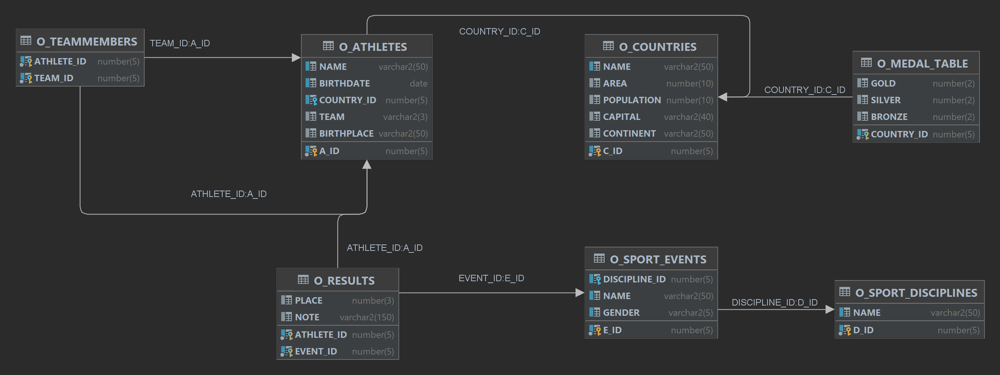

[↑ Back](./README.md)

# `D201` - `DELETE` statement

## Schema diagram



## Exercises

> [!IMPORTANT]
>
> You are going to modify the state of your schema, which can cause issues in other exercises. Thus, we must guarantee that each query is being executed in the original state.
>
> Execute your query that updates the database, checks the new state, and has a `ROLLBACK` statement. Do not commit your changes.

### Basic exercises

1. Delete each medal table entry that does not have at least `1` gold medal.

   ```sql
   DELETE FROM o_medal_table
   WHERE gold = 0;
   ```

1. Delete the country which name is *American Samoa*!

   ```sql
   DELETE FROM o_countries
   WHERE name = 'American Samoa';
   ``

1. Delete the country which name is *Hungary*!

   ```sql
   DELETE FROM o_countries
   WHERE name = 'Hungary';
   ```

   *Why cannot we delete Hungary but American Samoa?*

### Subquery-based exercises

1. Delete each country that does not have any medals.

   ```sql
   DELETE FROM o_countries
   WHERE c_id NOT IN (
      SELECT country_id
      FROM o_medal_table
   );
   ```

1. Delete each discipline that does not have any events.

   ```sql
   DELETE FROM o_sport_disciplines
   WHERE d_id NOT IN (
      SELECT discipline_id
      FROM o_sport_events
   );
   ```

1. Delete each event that which name is present and it does not have any corresponding result.

   ```sql
   SELECT *
   FROM o_sport_events
   WHERE
      name IS NOT NULL
      AND NOT EXISTS(
         SELECT *
         FROM o_results
         WHERE event_id = e_id
   );
   ```


### Manually cascaded exercise

1. Delete *Hungary* (as a country) from the database with all the corresponding data!

   1. Delete the corresponding medals.

      ```sql
      DELETE FROM o_medal_table
      WHERE country_id = (
         SELECT c_id
         FROM o_countries
         WHERE name = 'Hungary'
      );
      ```

   1. Delete the corresponding results.

      ```sql
      DELETE FROM o_results
      WHERE athlete_id IN (
         SELECT DISTINCT athlete_id
         FROM o_athletes
            JOIN o_countries
            ON o_athletes.country_id = o_countries.c_id
         WHERE o_countries.name = 'Hungary'
      );
      ```

   1. Delete the corresponding team member entries.
   
      ```sql
      DELETE FROM o_teammembers
      WHERE athlete_id IN (
         SELECT DISTINCT a_id
         FROM o_athletes
            LEFT JOIN o_countries
         ON country_id = c_id
         WHERE o_countries.name = 'Hungary'
      );
      ```

   1. Delete the corresponding athletes.

      ```sql
      DELETE FROM o_athletes
      WHERE country_id IN (
         SELECT DISTINCT c_id
         FROM o_countries
         WHERE name = 'Hungary'
      );
      ```

   1. Delete the country.

      ```sql
      DELETE FROM o_countries
      WHERE name  = 'Hungary';
      ```
